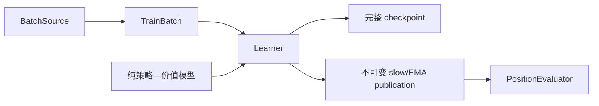

# 模型与训练边界

学生模型、Learner、训练产物和只读推理通过稳定契约交接，彼此不共享隐式状态：

- `model` 只定义纯前向、稳定输出和可关闭实验，不拥有优化器或持久化。
- `Learner` 只消费 `BatchSource`/`TrainBatch`，独占优化器、梯度、EMA 和样本尺度调度。
- `training` 负责损失、梯度、checkpoint、publication 及可恢复应用服务。
- `inference` 从一份不可变 publication 构造只读 evaluator，不访问 Learner 内部地址。

模型输出、训练批量和推理接口的公共语义见[公共契约](contracts.md)。格式版本、数据身份和
publication 身份必须显式保存；采集、训练和推理不能通过进程内模型引用绕过持久边界。

实现细节就近维护：

- [模型前向与扩展点](../../src/zero_ttt/model/README.md)
- [Learner、训练和产物提交](../../src/zero_ttt/training/README.md)
- [Publication evaluator 与推理聚批](../../src/zero_ttt/inference/README.md)
