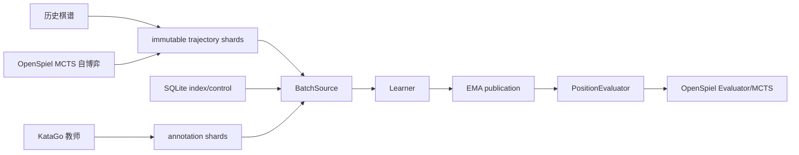

# 系统边界

## 项目定位

Zero-TTT 负责学生模型、训练基础设施、准确棋规、数据资产和学生 MCTS 自博弈。OpenSpiel
提供通用 Python PUCT/MCTS 控制流；本地 `GameState` 仍是规则真源。未修改的 KataGo 只作为
Human-SL/强搜索教师和独立 GTP 引擎。

## 当前已实现

- 固定 19×19 的 Tromp–Taylor 状态、合法着、历史、数子与特征编码。
- 策略、价值、所有权和目差输出的 Transformer。
- 与数据来源无关的严格 FP32 `Learner`、CPU EMA、checkpoint 和 publication。
- `TrajectoryRecord`/`AnnotationRecord`、NPZ ShardStore、SQLite Catalog、不可变 snapshot 和
  `CatalogBatchSource` 垂直切片。
- `BatchSource`、带逐样本标签 mask 的 `TrainBatch`、`PositionEvaluator` 三个稳定边界。
- KataGo v1.17.2 的独立 Docker 入口，以及固定版本的 OpenSpiel 源码子模块。
- OpenSpiel 本地状态适配、PUCT、自博弈采集、固定 batch-16 publication evaluator 和推理 broker。
- v4 自博弈审计记录、来源过滤 snapshot 与 snapshot mixture 训练。

## 当前未实现

- 跨 shard compaction、KataGo rich-NPZ 连接、Leela 混合采样与自动数据窗口监控。
- 自动采集—训练—发布循环、长期 replay 窗口与棋力评测。
- KataGo 教师 worker、局域网队列、混合采样和课程调度。
- 快权重和评级系统。

## 解耦原则

- 本地 `GameState` 唯一决定合法着、历史、终局和计分，不采用 OpenSpiel 内置 Go 状态。
- OpenSpiel 只负责搜索，不采用其内置模型、Learner 或完整 AlphaZero runner。
- Learner 只看 `BatchSource`/`TrainBatch`，不知道样本来自棋谱、自博弈还是教师。
- 模型不依赖 KataGo 协议、OpenSpiel 状态或搜索树类型。
- 采集器先写持久数据；KataGo 标签以 sidecar annotation 追加，不重写原始棋局。
- Learner 与 evaluator 可同时驻留 GPU，但默认分阶段执行，不并发提交 CUDA 工作。
- 所有运行、构建和测试只通过 Docker 支持。
- 神经网络全链路固定严格 FP32，不提供精度参数或自动转换。

## 代码依赖方向

重构后的代码按“领域契约 → adapter → application service → workflow 入口”组合：

- `game`、`model` 是纯领域层；`data.contracts` 与 `training.contracts` 定义跨层值对象。
- SQLite 由 `CatalogSession`、`CatalogRepository`、`SnapshotService` 和 `ShardLifecycle`
  四个 adapter/service 分担；公开 `Catalog` 只是兼容门面。
- NPZ 编解码由 `TrajectoryNpzCodec`/`AnnotationNpzCodec` 负责，`ShardStore` 只处理安全路径、
  原子提交和内容寻址。
- `TrainingSession` 与 `SelfPlayService` 是应用服务；CLI 和控制台只负责参数、交互和状态转换。
- `zero_ttt.console` 与 `zero_ttt.cli` 不得被 `game`、`model`、`data` 或 `training` 反向导入；
  该约束由 AST 架构测试持续检查。

所有持久格式只接受[集中登记的当前版本](versioning.md)。旧运行产物不自动删除，也不提供迁移器。
目标组件见 [Learner 与流程边界](learner-and-workflows.md)、
[序列化训练数据](../../src/zero_ttt/data/trajectory-storage.md)与
[统一训练生命周期](../workflows/training-lifecycle.md)。
